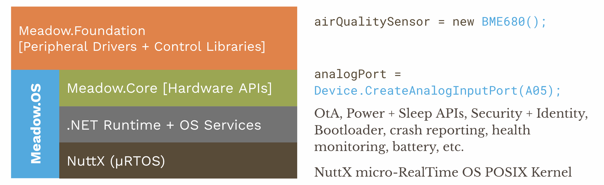

Welcome to the Wilderness Labs GitHub home! Here you will find our device platform code. It is nearly completely open and we're working on cleaning up and opening the remaining bits.

## Contents
* [Meadow Software Stack](#meadow-software-stack)
* [Managed Meadow.IoT Platform Stack](#managed-meadowiot-platform-stack)
* [Repo Status](#repo-status)
    * [Meadow.Core Repos](#meadowcore-repos)
    * [Meadow.Foundation Repos](#meadowfoundation-repos)
    * [Tooling](#tooling)
    * [IoT Accelerator Repos](#iot-accelerator-repos)
    * [Project Samples](#project-samples)
* [Support](#support)

## Meadow Software Stack

The following diagram illustrates the layers of the device platform:

For a more complete understanding of the platform, please check out our [developer documentation](http://developer.wildernesslabs.co/).

## Managed Meadow.IoT Platform Stack

The managed portion of the Meadow.IoT stack includes the following layers:
* **Meadow.Core** - Contains the hardware APIs and userland services that run on Meadow.OS and other .NET capable operating systems and expose the underlying hardware and platform services.
* **Meadow.Foundation** - Peripheral drivers and libraries that run on Meadow.Core and provides plug-and-play APIs for sensors, motors, displays, etc., as well as high level libraries for working with hardware devices. For a full list of supported peripherals and included libraries refer to [this page](https://developer.wildernesslabs.co/Meadow/Meadow.Foundation/Peripherals/). 

## Repo Status

### Meadow.Core Repos

| Repo | Nuget | `Main` Branch | `Develop` Branch |
|-------------------|--|--|--| 
|              |          |  |  |
|        |      |  |  |
|  |  |  |  |
|                 |                      |  |  |
|           |        |  |  |
|                             |            |  |  |

### Meadow.Foundation Repos

| Repo | `Main` Branch | `Develop` Branch |
|-------------------|--|--| 
|  |  |  |
|  |  |  |
|  |  |  |
|  |  |  |
|  |  |  |
|  |  |  |
|  |  |  |

### Tooling

The tooling stack includes both the CLI source as well as the IDE extensions.

| Repo |
|------------|
|  |
|  |
|  |
|  |

### IoT Accelerator Repos

All of the IoT accelerator designs can be found below:

| Repo | Nuget | `Main` Branch | `Develop` Branch |
|-------------------------|--|--|--| 
|  |  |  |  |
|  |  |  |  |
|  |  |  |  |
|  |  |  |  |

### Project Samples

| Repo | `Main` Branch | `Develop` Branch |
|-----------------|--|--|
|  |  |  |
|  |  |  |
|  |  |  |
|  |  |  |
|  |  |  |
|  |  |  |

## Support

Found any bugs or issues in one of our repos? 
* File an [issue](https://github.com/WildernessLabs/Meadow.Desktop.Samples/issues) with a repro case to investigate, and/or
* Join our [public Slack](http://slackinvite.wildernesslabs.co/), where we have an awesome community helping, sharing and building amazing things using Meadow.