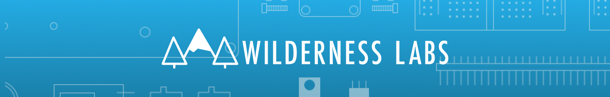

# Wilderness Labs

## Hacktoberfest Issues/Tasks

### [Documentation](https://github.com/WildernessLabs/Documentation)

* [More warnings about charge-only USB cables](https://github.com/WildernessLabs/Documentation/issues/549)
* [Change URL to the Meadow VS Extension in Hello World](https://github.com/WildernessLabs/Documentation/issues/548)
* [HelloPulsy docs inaccurate for F7FeatherV1](https://github.com/WildernessLabs/Documentation/issues/480)
* [Windows deployment docs unclear about bootloader mode](https://github.com/WildernessLabs/Documentation/issues/394)
* [AC characteristics label for period leader pointing wrong direction](https://github.com/WildernessLabs/Documentation/issues/311)

### [Meadow.Foundation](https://github.com/WildernessLabs/Meadow.Foundation)

* [Vl53l0x readings are inconsistant](https://github.com/WildernessLabs/Meadow.Foundation/issues/805)
* [Add support for BMP280](https://github.com/WildernessLabs/Meadow.Foundation/issues/696)
* [Add/verify IDisposable pattern for drivers](https://github.com/WildernessLabs/Meadow.Foundation/issues/257)
* [Bno055 not fully calibrating](https://github.com/WildernessLabs/Meadow.Foundation/issues/234)
* [µGraphics - Line stroke on drawing lines gets wrong geometry](https://github.com/WildernessLabs/Meadow.Foundation/issues/126)
* [Driver Request: RA8876 Display](https://github.com/WildernessLabs/Meadow.Foundation/issues/110)

### [VS_Win_Meadow_Extension](https://github.com/WildernessLabs/VS_Win_Meadow_Extension)

* [Surface certain Meadow.CLI commands so they are accesibile from the IDE](https://github.com/WildernessLabs/VS_Win_Meadow_Extension/issues/148)
* [Make the device list appear in the debugging dropdown.](https://github.com/WildernessLabs/VS_Win_Meadow_Extension/issues/147)

## Connect With Us

## Repo Status

| Meadow.Core Stack |  |  |  |
|-------------------|--|--|--| 
|              |          |  |  |
|        |      |  |  |
|  |  |  |  |
|                 |                      |  |  |
|           |        |  |  |
|                             |            |  |  |

| Meadow.Foundation |  |  |
|-------------------|--|--| 
|  |  |  |
|  |  |  |
|  |  |  |
|  |  |  |
|  |  |  |
|  |  |  |
|  |  |  |

| Meadow IoT Accelerators |  |  |  |
|-------------------------|--|--|--| 
|  |  |  |  |
|  |  |  |  |
|  |  |  |  |
|  |  |  |  |

| Project Samples |  |  |
|-----------------|--|--|
|  |  |  |
|  |  |  |
|  |  |  |
|  |  |  |
|  |  |  |

| Tooling |
|------------|
|  |
|  |
|  |
|  |

